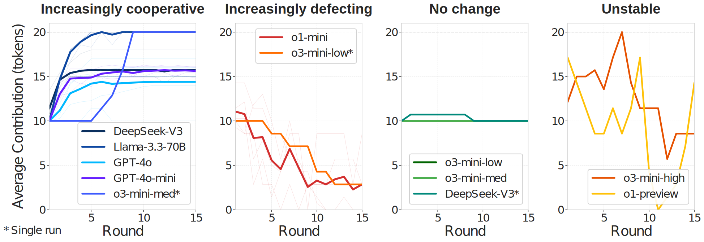

# 🤖 LLM Cooperation Lab


## What happens when AI agents choose between self-interest and the greater good?

This framework lets you simulate how different Large Language Models (LLMs) handle public goods dilemmas and whether they'll pay the price to enforce cooperation through sanctions. Based on classic behavioral economics experiments, we explore whether LLMs prefer cooperative institutions that allow for costly norm enforcement.

## 💡 Key Discoveries

- 🔄 Traditional LLMs unexpectedly outperform reasoning-focused models at cooperation
- 🏆 Some models achieve near-human cooperation levels but using different strategies
- 🎁 LLMs strongly prefer rewarding cooperation, while humans favor punishing defection
- 📊 Four distinct behavioral patterns emerge across model architectures



## 🔍 Why It Matters

Understanding how LLMs cooperate can help us:
- Build better multi-agent AI systems that work together
- Explore alignment techniques for collaborative AI
- Identify which models might be better suited for cooperative tasks
- Compare AI social behaviors with human patterns

Our research reveals that current approaches to improving LLMs by enhancing reasoning capabilities doesn't necessarily improve cooperation - traditional models often cooperate better than reasoning-optimized ones.

## 🚀 Quick Start

Run a complete simulation with default parameters:
```bash
python main.py --api-provider openai --model-name gpt-4o
```

## 📋 Project Structure

The codebase consists of these key components:

- **Core Simulation Files**:
  - `agent.py`: LLM-based simulation participants
  - `environment.py`: Game environment and round progression
  - `institution.py`: Sanctioning and Sanction-Free institutions
  - `parameters.py`: Configurable simulation parameters
  - `main.py`: Entry point for running experiments

- **API Client Files**:
  - `azure_openai_client.py`: Azure OpenAI API
  - `openai_client.py`: OpenAI API
  - `openrouter_client.py`: OpenRouter API
  - `kluster_ai_client.py`: KlusterAI API

## 🛠️ Installation

1. Clone this repository
2. Install the required dependencies:

```bash
pip install openai pandas numpy matplotlib backoff tqdm
```

## ⚙️ Configuration

The simulation is configured through `parameters.py`:

| Parameter | Description | Default |
|-----------|-------------|---------|
| `NUM_AGENTS` | Simulation participants | 7 |
| `NUM_ROUNDS` | Simulation duration | 15 |
| `PUBLIC_GOOD_MULTIPLIER` | Multiplication factor | 1.6 |
| `INITIAL_TOKENS` | Starting tokens per agent | 1000 |
| `ENDOWMENT_STAGE_1` | Tokens per round | 20 |
| `ENDOWMENT_STAGE_2` | Tokens for sanctioning | 20 |
| `PUNISHMENT_EFFECT` | Impact of punishment | -3 |
| `REWARD_EFFECT` | Impact of reward | +1 |

## 🧪 Running Experiments

### API Configuration Options

The simulation supports multiple LLM providers:

1. **Azure OpenAI**:
```bash
python main.py --api-provider azure --deployment-name YOUR_DEPLOYMENT --azure-endpoint YOUR_ENDPOINT
```

2. **OpenAI**:
```bash
python main.py --api-provider openai --model-name MODEL_NAME
```

3. **OpenRouter**:
```bash
python main.py --api-provider openrouter --model-name MODEL_NAME
```

4. **KlusterAI**:
```bash
python main.py --api-provider kluster --model-name MODEL_NAME
```

### Environment Variables

You can also configure API access via environment variables:
- Azure: `AZURE_API_KEY`, `AZURE_ENDPOINT`, `AZURE_DEPLOYMENT_NAME`
- OpenAI: `OPENAI_API_KEY`, `OPENAI_MODEL_NAME`
- OpenRouter: `OPENROUTER_API_KEY`

## 📊 Output & Analysis

Simulation results are saved as JSON files with the naming pattern:
```
simulation_results_{model_name}_{num_agents}agents_{num_rounds}rounds.json
```

Each file contains detailed agent decisions, including:
- Institution choices with reasoning
- Contribution amounts with reasoning
- Punishment/reward allocations with reasoning
- Payoffs and cumulative statistics

The repository includes code for analyzing agent reasoning patterns and classifying strategies.


## 📄 Citation

If using this codebase for research, please cite our paper:


## 🔗 Join the Research

Try the framework with different models, contribute new analysis methods, or cite our work in your research on AI cooperation.

This project is provided for research purposes.

================================================

# AI Research Assistant Template

A minimal template for transforming your research codebase into an AI-agent-friendly environment. This template helps you integrate Claude Code and other AI agents into your research workflow.

## 🚀 Quick Start

1. **Clone this template**
   ```bash
   git clone [this-repo] ai-research-template
   cd ai-research-template
   ```

2. **Merge with your research codebase**
   ```bash
   cd [your-research-project]
   git remote add template [path-to-template]
   git fetch template
   git merge template/main --allow-unrelated-histories
   ```

3. **Run the setup wizard**
   ```bash
   claude
   > /setup
   ```

The `/setup` command will guide you through:
- Integrating your existing code
- Creating comprehensive documentation
- Building custom commands for your workflow
- Setting up verification infrastructure

## 📚 Workshop Materials

If you're new to AI-assisted research or want a structured learning experience, check out our comprehensive workshop materials:

### For Participants
- **[Participant Guide](docs/workshop/participant-guide.md)** - Complete 3-hour hands-on workshop
- **[Quick Reference](docs/workshop/quick-reference.md)** - Essential commands and patterns at a glance
- **[Troubleshooting Guide](docs/workshop/troubleshooting.md)** - Solutions to common issues

### For Instructors
- **[Facilitator Guide](docs/workshop/facilitator-guide.md)** - How to run the workshop effectively

The workshop covers:
1. Setting up your research environment with the `/setup` wizard
2. Creating comprehensive context documentation
3. Building custom commands for your research tasks
4. Implementing with verification loops
5. Using multi-agent analysis patterns
6. Managing long research sessions

## 📁 What's Included

```
.claude/
├── commands/          # Slash commands (start with /setup)
├── hooks/            # Safety hooks and automation
└── scripts/          # Integration utilities

ai_docs/              # Your research documentation (empty)
specs/                # Experiment specifications
│   └── EXAMPLE_RESEARCH_SPEC.md  # Template for creating detailed specs
experiments/          # Experiment tracking (empty)
scripts/              # Automation scripts
docs/                 # Template documentation
utils/               # Python utilities for research workflows
external_codebases/  # For integrating external code
```

## 🎯 Core Philosophy

This template provides the **minimal infrastructure** to:
1. Help AI agents understand your research context
2. Create custom automation for your specific workflow
3. Build verification loops so AI can check its work
4. Manage long research sessions efficiently

## 🛠️ Key Commands

- `/setup` - Interactive setup wizard (START HERE)
- `/crud-claude-commands` - Create your own custom commands
- `/page` - Save session state before context fills
- `/plan-with-context` - Smart planning for complex tasks
- `/parallel-analysis-example` - Example of multi-agent patterns

## 📚 Creating Your Own Commands

After running `/setup`, create domain-specific commands:

```bash
# Create a command for your experiment workflow
/crud-claude-commands create run-experiment

# Create analysis commands
/crud-claude-commands create analyze-results

# Create debugging helpers
/crud-claude-commands create debug-training
```

## 🔄 Workflow Overview

1. **Context Gathering** (Most Important!)
   - 15-20 minute speech-to-text brain dump
   - Add papers and documentation to `ai_docs/`
   - Create comprehensive CLAUDE.md

2. **Specification Writing**
   - Copy `specs/EXAMPLE_RESEARCH_SPEC.md` as starting point
   - Fill out problem statement, approach, and success criteria
   - Use AI to help draft technical sections
   - Specs become your source of truth

3. **Custom Command Creation**
   - Identify repetitive tasks
   - Create commands for your workflow
   - Add verification steps
   - Link commands to specs

4. **Experiment Automation**
   - Implement based on spec
   - Build with verification loops
   - Test against success criteria
   - Iterate until reliable

5. **Scale Your Research**
   - Use multiple models (Gemini for large context, O3 for reasoning)
   - Run parallel experiments
   - Maintain rigorous verification

## 📖 Key Features

- **Specification-Driven Development**: Use the example spec template to plan before coding
- **Custom Command System**: Build reusable workflows specific to your research
- **Context Management**: Efficient handling of long research sessions
- **Verification Loops**: Ensure AI agents can check their own work
- **Multi-Model Support**: Integrate Gemini, O3, and other models as needed

## 🤝 Contributing

This template is designed to be minimal and extensible. Feel free to:
- Add domain-specific examples
- Share successful command patterns
- Improve the setup workflow

## 📝 License

MIT - Use freely for your research!